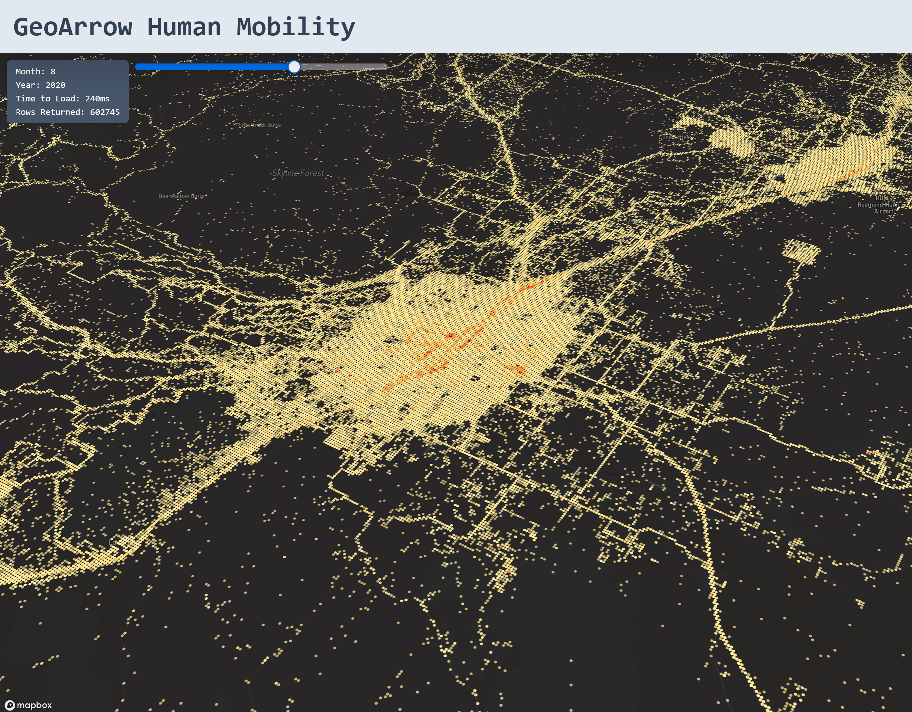

# GeoArrow Human Mobility Visualization in Deck.gl

### Leveraging the GeoArrow data format, we can visualize ~500,000 points in roughly ~150-250ms.



## Data Formats

### GeoArrow
```TypeScript
const fetchData = async () => {
    const start = new Date();
    const GEOARROW_POINT_DATA = `http://localhost:8081/movement_wbounds_${month}.feather`;
    const response = await fetch(GEOARROW_POINT_DATA);
    const buffer = await response.arrayBuffer();
    const table = arrow.tableFromIPC(buffer);
    setTable(table);
    setRowCount(table.numRows)
    const layer = new GeoArrowScatterplotLayer({
        id: "geoarrow-points",
        data: table,
        getFillColor: table.getChild("colors"),
        opacity: 0.5,
        getRadius: 50,
        radiusMinPixels: 0.1,
        getPosition: table.getChild("geometry")
    });

    setLayers([layer]);
    const end = new Date();
    setTime(end - start);
};
```